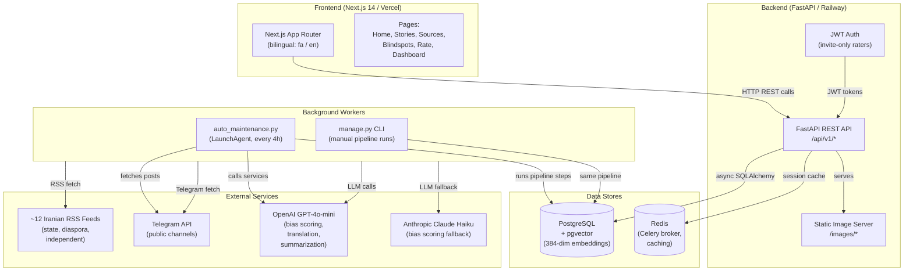
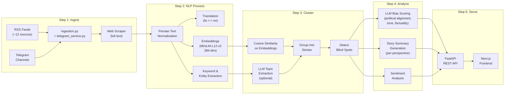
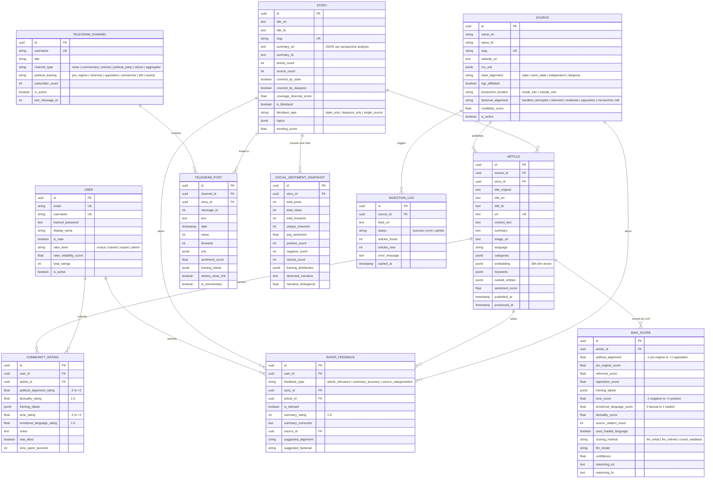
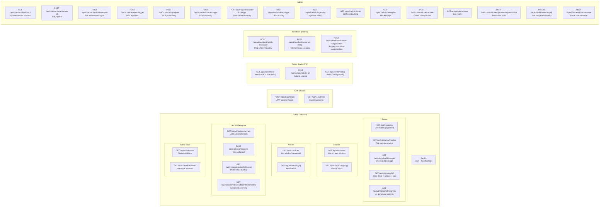
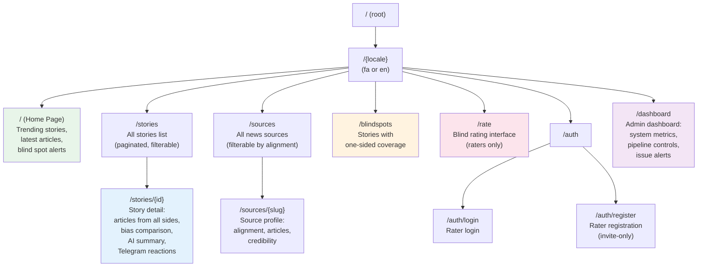
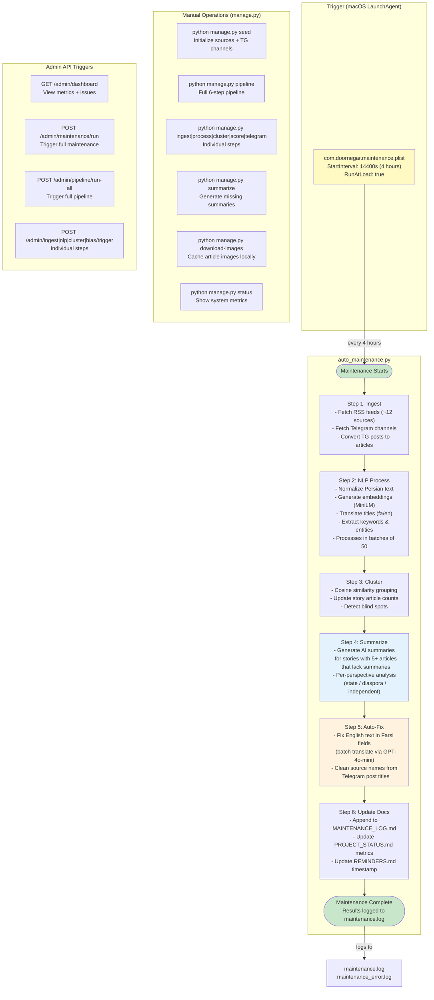

# Doornegar Architecture -- Visual Diagrams

This document provides visual Mermaid diagrams of the Doornegar system architecture.
Render these in any Markdown viewer that supports Mermaid (GitHub, VS Code with the Mermaid extension, Obsidian, etc.).

---

## 1. System Architecture -- High-Level Component Diagram

How the major pieces of Doornegar connect to each other.

**Key points:**
- The frontend is a Next.js 14 app with bilingual routing (`/fa/...` and `/en/...`).
- The backend is a FastAPI application with fully async database operations.
- Background processing runs via `auto_maintenance.py` on a macOS LaunchAgent (every 4 hours) or manually via `manage.py`.
- PostgreSQL stores all data including 384-dimensional multilingual embeddings for article similarity.
- LLM calls go primarily to OpenAI GPT-4o-mini, with Anthropic Claude Haiku as a fallback.

---

## 2. Data Pipeline Flow

The complete journey of a news article from RSS feed to the user's screen.

**Pipeline steps in detail:**

| Step | Service File | What It Does |
|------|-------------|--------------|
| Ingest | `ingestion.py`, `telegram_service.py` | Fetches RSS feeds and Telegram posts, deduplicates by URL |
| NLP | `nlp_pipeline.py`, `translation.py` | Normalizes Persian text, generates embeddings, translates titles, extracts keywords |
| Cluster | `clustering.py`, `topic_clustering.py` | Groups articles into stories using cosine similarity on embeddings |
| Analyze | `bias_scoring.py`, `story_analysis.py` | LLM scores each article for bias; generates per-perspective summaries |
| Serve | `api/v1/*.py` | REST endpoints deliver data to the frontend |

---

## 3. Database Schema -- Entity Relationship Diagram

All tables and their relationships.

**Key design decisions:**
- All primary keys are UUIDs (not auto-increment integers).
- Bilingual fields use `_fa` / `_en` suffixes throughout.
- Embeddings and variable-length lists (keywords, entities, framing labels) are stored as PostgreSQL JSONB.
- The `story.summary_en` field stores the full per-perspective analysis as a JSON blob (state view, diaspora view, independent view, bias explanation, scores).

---

## 4. API Endpoints Map

All REST endpoints grouped by function.

**Access control:**
- **Public** endpoints require no authentication.
- **Auth/Rating/Feedback** endpoints require a JWT token from an invited rater.
- **Admin** endpoints are currently unprotected (admin auth is on the roadmap).

---

## 5. Frontend Page Structure

The Next.js app uses locale-based routing for bilingual support.

**Navigation flow:**
- The home page shows trending stories and blind spot alerts.
- Users can drill into any story to see how different outlets (state, diaspora, independent) cover it.
- The `/rate` page is restricted to authenticated, invited raters who see articles without source attribution (blind rating).
- The `/dashboard` is for admin use: system health, pipeline triggers, and issue tracking.

---

## 6. Maintenance and Automation Flow

How the system stays up-to-date automatically.

**Automation details:**
- The macOS LaunchAgent (`com.doornegar.maintenance.plist`) triggers `auto_maintenance.py` every 4 hours and on boot.
- Each step is wrapped in try/except so a failure in one step does not block subsequent steps.
- The NLP processing step runs in a loop, processing batches of 50 articles until all are done.
- The summarization step only targets stories with 5+ articles that do not yet have a summary.
- The auto-fix step uses GPT-4o-mini to batch-translate any English text that ended up in Farsi fields.
- All results are logged to `maintenance.log` (stdout) and `maintenance_error.log` (stderr).
- The admin dashboard at `/admin/dashboard` reads `maintenance.log` to display the last run time and status.
- Manual operations via `manage.py` or the Admin API can trigger the same steps on demand.

---

## Auto-detected changes (2026-04-11 17:20)

**New service files**: topic_service.py

**New API files**: improvements.py, suggestions.py

**New model files**: improvement.py, suggestion.py

**New frontend pages**: improve

> These files were detected but not yet documented in the diagrams above. Update the diagrams to include them.
