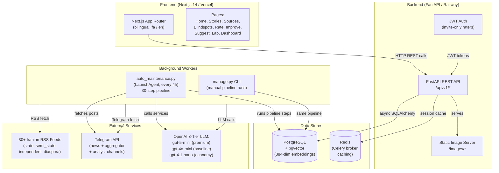
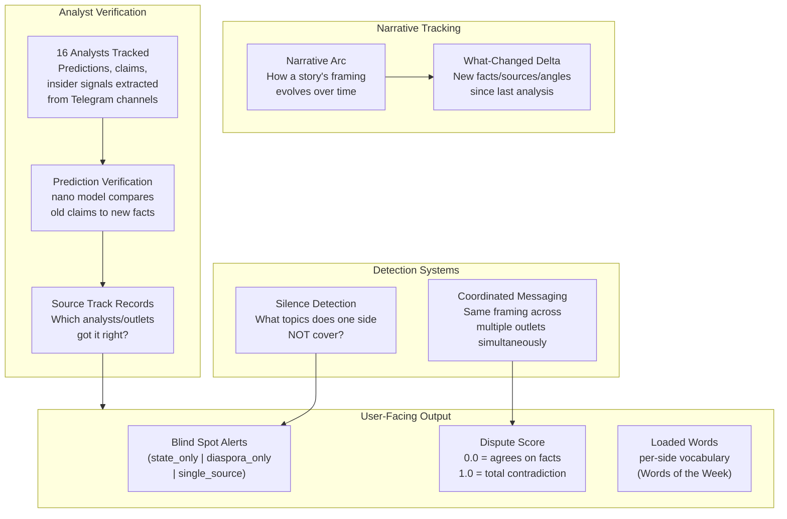
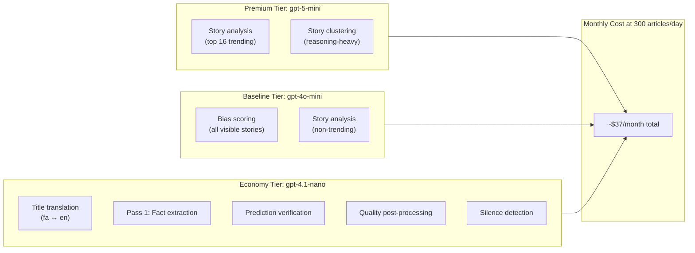
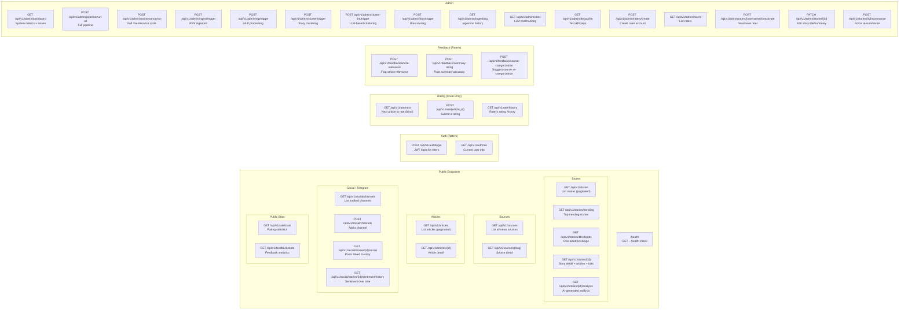
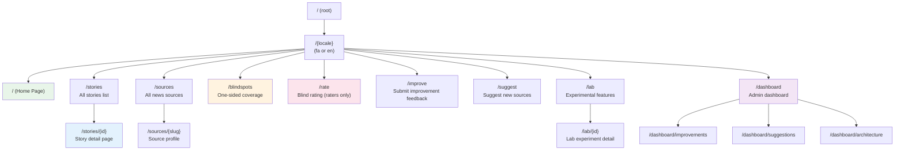
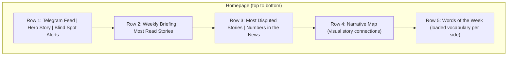
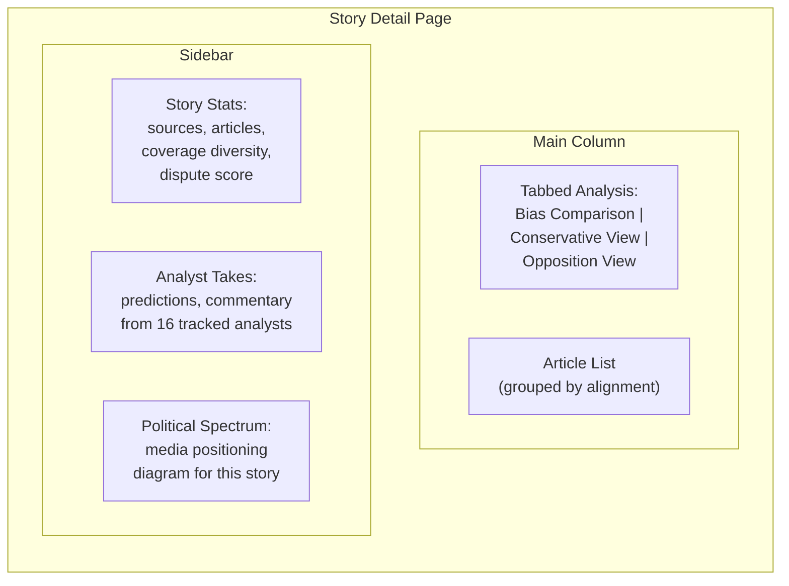
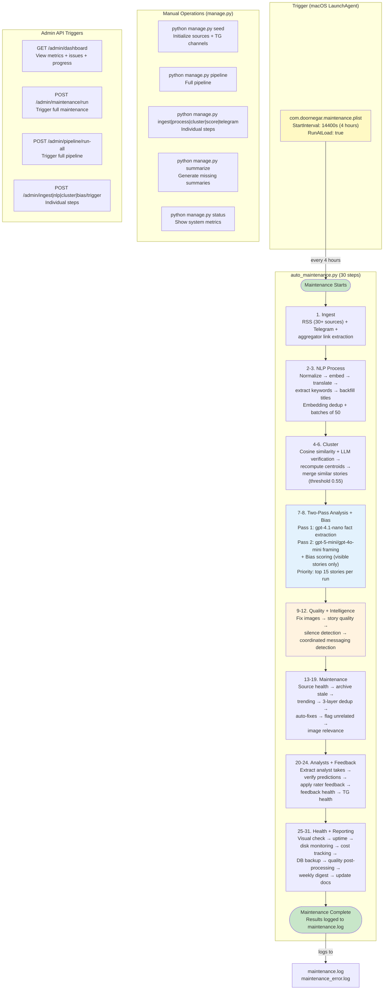

# Doornegar Architecture -- Visual Diagrams

This document provides visual Mermaid diagrams of the Doornegar system architecture.
Render these in any Markdown viewer that supports Mermaid (GitHub, VS Code with the Mermaid extension, Obsidian, etc.).

---

## 1. System Architecture -- High-Level Component Diagram

How the major pieces of Doornegar connect to each other.

**Key points:**
- The frontend is a Next.js 14 app with bilingual routing (`/fa/...` and `/en/...`).
- The backend is a FastAPI application with fully async database operations.
- Background processing runs via `auto_maintenance.py` on a macOS LaunchAgent (every 4 hours) or manually via `manage.py`.
- PostgreSQL stores all data including 384-dimensional multilingual embeddings for article similarity.
- LLM calls use a **3-tier model strategy**: gpt-5-mini for premium analysis (top-N trending stories, clustering), gpt-4o-mini for baseline (bias scoring, long-tail stories), gpt-4.1-nano for economy tasks (translation, fact extraction).
- Estimated cost: **~$37/month at 300 articles/day**.

---

## 2. Data Pipeline Flow -- Two-Pass Analysis

The complete 30-step pipeline from news ingestion to the user's screen.

```mermaid
flowchart LR
    subgraph Ingest["Phase 1: Ingest"]
        RSS["RSS Feeds<br/>(30+ sources)"]
        TG["Telegram<br/>Channels"]
        AGG["Aggregator<br/>Channels<br/>(link extraction)"]
        Scraper["Web Scraper<br/>(full text)"]
        IngestSvc["ingestion.py<br/>+ telegram_service.py"]
    end

    subgraph NLP["Phase 2: NLP Process"]
        Normalize["Persian Text<br/>Normalization"]
        Translate["Translation<br/>(fa <-> en)<br/>gpt-4.1-nano"]
        Embed["Embeddings<br/>(MiniLM-L12-v2<br/>384-dim)"]
        EmbedDedup["Embedding<br/>Deduplication"]
        Keywords["Keyword &<br/>Entity Extraction"]
        Titles["Backfill<br/>Farsi Titles"]
    end

    subgraph Cluster["Phase 3: Cluster"]
        Cosine["Cosine Similarity<br/>+ LLM Verification<br/>(gpt-5-mini)"]
        Centroids["Recompute<br/>Story Centroids"]
        MergeSimilar["Merge Similar<br/>Visible Stories"]
    end

    subgraph Analyze["Phase 4: Two-Pass Analysis"]
        Pass1["Pass 1: Fact Extraction<br/>(gpt-4.1-nano)<br/>~$0.001/story"]
        Pass2["Pass 2: Framing Analysis<br/>(gpt-5-mini or gpt-4o-mini)<br/>facts + context → deep analysis"]
        BiasLLM["Bias Scoring<br/>(gpt-4o-mini)<br/>visible stories only"]
    end

    subgraph Intel["Phase 5: Intelligence"]
        Silence["Silence Detection<br/>(what's NOT covered)"]
        Coordination["Coordinated<br/>Messaging Detection"]
        Predictions["Verify Analyst<br/>Predictions"]
        AnalystTakes["Extract Analyst<br/>Takes from TG"]
    end

    subgraph QA["Phase 6: Quality & Serve"]
        FixImages["Fix Broken<br/>Images"]
        StoryQuality["Story Quality<br/>Checks"]
        Trending["Recalculate<br/>Trending Scores"]
        Dedup3["3-Layer<br/>Deduplication"]
        Fixes["Auto-Fix<br/>Common Issues"]
        FlagUnrelated["Flag Unrelated<br/>Articles"]
        ImageRelevance["Image Relevance<br/>Check"]
        QualityPost["Quality<br/>Post-Processing<br/>(LLM review)"]
        Digest["Weekly Digest"]
        APILayer["FastAPI<br/>REST API"]
        FrontendApp["Next.js<br/>Frontend"]
    end

    RSS --> IngestSvc
    TG --> IngestSvc
    AGG --> IngestSvc
    IngestSvc --> Scraper
    Scraper --> Normalize

    Normalize --> Translate
    Normalize --> Embed
    Embed --> EmbedDedup
    Normalize --> Keywords
    Keywords --> Titles

    EmbedDedup --> Cosine
    Cosine --> Centroids
    Centroids --> MergeSimilar

    MergeSimilar --> Pass1
    Pass1 -->|"structured facts"| Pass2
    Pass2 --> BiasLLM

    BiasLLM --> Silence
    BiasLLM --> Coordination
    BiasLLM --> AnalystTakes
    AnalystTakes --> Predictions

    Predictions --> FixImages
    FixImages --> StoryQuality
    StoryQuality --> Trending
    Trending --> Dedup3
    Dedup3 --> Fixes
    Fixes --> FlagUnrelated
    FlagUnrelated --> ImageRelevance
    ImageRelevance --> QualityPost
    QualityPost --> Digest
    Digest --> APILayer
    APILayer --> FrontendApp
```

**Two-Pass Analysis in detail:**

| Pass | Model | Cost | What It Does |
|------|-------|------|--------------|
| Pass 1 | gpt-4.1-nano | ~$0.001/story | Extracts structured facts from each article: who, what, where, numbers, claims. First 800 chars per article. |
| Pass 2 | gpt-5-mini (top 16) or gpt-4o-mini (rest) | ~$0.02-0.05/story | Receives Pass 1 facts + full articles + narrative context. Produces per-perspective analysis, bias explanation, dispute scores, loaded words, media neutrality scores. |

**Context injected into Pass 2 (no extra LLM cost):**
- Extracted facts from Pass 1
- Source metadata (alignment, faction, IRGC affiliation)
- Story priority and trending score
- Previous analysis delta (what changed)

**Full pipeline step list (30 steps + doc update):**

| # | Step | Key Service |
|---|------|-------------|
| 1 | Ingest RSS + Telegram + aggregators | `ingestion.py`, `telegram_service.py` |
| 2 | NLP process (embed, translate, extract) | `nlp_pipeline.py` |
| 3 | Backfill Farsi titles | `translation.py` |
| 4 | Cluster articles into stories | `clustering.py` |
| 5 | Recompute story centroid embeddings | centroid averaging |
| 6 | Merge similar visible stories | cosine threshold 0.55 |
| 7 | Summarize new stories (two-pass, priority top 15) | `story_analysis.py` |
| 8 | Bias scoring (visible stories only) | `bias_scoring.py` |
| 9 | Fix broken images | `image_downloader.py` |
| 10 | Story quality checks | quality heuristics |
| 11 | Silence detection | coverage gap analysis |
| 12 | Coordinated messaging detection | cross-source pattern matching |
| 13 | Source health | feed availability checks |
| 14 | Archive stale stories | age-based archiving |
| 15 | Recalculate trending scores | recency + volume + diversity |
| 16 | Deduplicate articles (3-layer) | URL + embedding + content dedup |
| 17 | Auto-fix common issues | field corrections, TG title cleanup |
| 18 | Flag unrelated articles | LLM-assisted relevance check |
| 19 | Image relevance check | image-story match scoring |
| 20 | Extract analyst takes from Telegram | `analyst_take.py` extraction |
| 21 | Verify analyst predictions | nano model claim verification |
| 22 | Apply rater feedback | `rating_aggregation.py` |
| 23 | Feedback system health | consistency checks |
| 24 | Telegram session health | connection + fetch validation |
| 25 | Visual check | rendering validation |
| 26 | Uptime check | endpoint availability |
| 27 | Disk monitoring | storage usage |
| 28 | LLM cost tracking | per-model cost logging |
| 29 | Database backup | pg_dump |
| 30 | Quality post-processing (LLM review) | nano model QA |
| 31 | Weekly digest | summary email/report |
| -- | Update project docs | `MAINTENANCE_LOG.md`, `PROJECT_STATUS.md` |

---

## 3. Database Schema -- Entity Relationship Diagram

All tables and their relationships.

```mermaid
erDiagram
    SOURCE {
        uuid id PK
        string name_en
        string name_fa
        string slug UK
        text website_url
        jsonb rss_urls
        text logo_url
        string state_alignment "state | semi_state | independent | diaspora"
        boolean irgc_affiliated
        string production_location "inside_iran | outside_iran"
        string factional_alignment "hardline | principlist | reformist | moderate | opposition | monarchist | left"
        jsonb media_dimensions "8-axis editorial scoring (1-5 each)"
        float credibility_score
        boolean is_active
    }

    ARTICLE {
        uuid id PK
        uuid source_id FK
        uuid story_id FK
        text title_original
        text title_en
        text title_fa
        text url UK
        text content_text
        text summary
        text image_url
        string language
        jsonb categories
        jsonb embedding "384-dim vector"
        jsonb keywords
        jsonb named_entities
        float sentiment_score
        timestamp published_at
        timestamp processed_at
    }

    STORY {
        uuid id PK
        text title_en
        text title_fa
        string slug UK
        text summary_en "JSON: per-perspective analysis"
        text summary_fa
        int article_count
        int source_count
        boolean covered_by_state
        boolean covered_by_diaspora
        float coverage_diversity_score
        boolean is_blindspot
        string blindspot_type "state_only | diaspora_only | single_source"
        jsonb topics
        float trending_score
        int priority "Manual: higher = more prominent"
        jsonb centroid_embedding "Mean of article embeddings"
        timestamp llm_failed_at "Retry backoff: skip 24h"
    }

    ANALYST {
        uuid id PK
        string name_en
        string name_fa
        string slug UK
        string political_leaning "reformist | conservative | independent | opposition | academic"
        string location "inside_iran | outside_iran"
        string affiliation
        jsonb focus_areas
        text bio_en
        text bio_fa
        boolean is_active
        boolean is_imprisoned
    }

    ANALYST_TAKE {
        uuid id PK
        uuid analyst_id FK
        uuid story_id FK
        uuid telegram_post_id FK
        text raw_text
        string summary_fa
        string key_claim
        string take_type "prediction | reasoning | insider_signal | fact_check | historical_parallel | commentary"
        string confidence_direction "bullish | bearish | neutral"
        boolean verified_later
        text verification_note
        timestamp published_at
    }

    BIAS_SCORE {
        uuid id PK
        uuid article_id FK
        float political_alignment "-1 pro-regime to +1 opposition"
        float pro_regime_score
        float reformist_score
        float opposition_score
        jsonb framing_labels
        float tone_score "-1 negative to +1 positive"
        float emotional_language_score "0 factual to 1 loaded"
        float factuality_score
        int source_citation_count
        boolean uses_loaded_language
        string scoring_method "llm_initial | llm_refined | crowd_validated"
        string llm_model
        float confidence
        text reasoning_en
        text reasoning_fa
    }

    USER {
        uuid id PK
        string email UK
        string username UK
        text hashed_password
        string display_name
        boolean is_rater
        string rater_level "novice | trained | expert | admin"
        float rater_reliability_score
        int total_ratings
        boolean is_active
    }

    COMMUNITY_RATING {
        uuid id PK
        uuid user_id FK
        uuid article_id FK
        float political_alignment_rating "-2 to +2"
        float factuality_rating "1-5"
        jsonb framing_labels
        float tone_rating "-2 to +2"
        float emotional_language_rating "1-5"
        text notes
        boolean was_blind
        int time_spent_seconds
    }

    IMPROVEMENT_FEEDBACK {
        uuid id PK
        string target_type "story | story_title | story_image | article | source | layout | homepage | other"
        string target_id
        text target_url
        string issue_type "wrong_title | bad_image | wrong_clustering | bad_summary | layout_issue | bug | feature_request | other"
        text current_value
        text suggested_value
        text reason
        string rater_name
        string status "open | in_progress | done | wont_do | duplicate"
        string priority "low | medium | high"
    }

    TELEGRAM_CHANNEL {
        uuid id PK
        string username UK
        string title
        string channel_type "news | commentary | activist | political_party | citizen | aggregator"
        string political_leaning "pro_regime | reformist | opposition | monarchist | left | neutral"
        boolean is_aggregator "True for link-aggregation channels"
        int subscriber_count
        boolean is_active
        int last_message_id
    }

    TELEGRAM_POST {
        uuid id PK
        uuid channel_id FK
        uuid story_id FK
        int message_id
        text text
        timestamp date
        int views
        int forwards
        int reply_count
        jsonb urls
        float sentiment_score
        jsonb framing_labels
        jsonb keywords
        boolean shares_news_link
        boolean is_commentary
    }

    SOCIAL_SENTIMENT_SNAPSHOT {
        uuid id PK
        uuid story_id FK
        int total_posts
        int total_views
        int total_forwards
        int unique_channels
        float avg_sentiment
        int positive_count
        int negative_count
        int neutral_count
        jsonb framing_distribution
        text dominant_narrative
        float narrative_divergence
    }

    INGESTION_LOG {
        uuid id PK
        uuid source_id FK
        text feed_url
        string status "success | error | partial"
        int articles_found
        int articles_new
        text error_message
        timestamp started_at
    }

    SOURCE ||--o{ ARTICLE : "publishes"
    STORY ||--o{ ARTICLE : "groups"
    ARTICLE ||--o{ BIAS_SCORE : "scored by LLM"
    ARTICLE ||--o{ COMMUNITY_RATING : "rated by humans"
    USER ||--o{ COMMUNITY_RATING : "submits"
    ANALYST ||--o{ ANALYST_TAKE : "authors"
    STORY ||--o{ ANALYST_TAKE : "about"
    TELEGRAM_POST ||--o{ ANALYST_TAKE : "extracted from"
    TELEGRAM_CHANNEL ||--o{ TELEGRAM_POST : "contains"
    STORY ||--o{ TELEGRAM_POST : "linked to"
    STORY ||--o{ SOCIAL_SENTIMENT_SNAPSHOT : "tracked over time"
    SOURCE ||--o{ INGESTION_LOG : "logged"
```

**Key design decisions:**
- All primary keys are UUIDs (not auto-increment integers).
- Bilingual fields use `_fa` / `_en` suffixes throughout.
- Embeddings and variable-length lists (keywords, entities, framing labels) are stored as PostgreSQL JSONB.
- The `story.summary_en` field stores the full per-perspective analysis as a JSON blob (state view, diaspora view, independent view, bias explanation, dispute scores, loaded words, media neutrality scores).
- `story.centroid_embedding` stores the mean of all article embeddings, used for fast cosine pre-filtering during clustering.
- `analyst_take.take_type` classifies insights: predictions (verifiable later), reasoning, insider signals, fact checks, historical parallels, and commentary.
- `telegram_channel.is_aggregator` flags channels that post links to articles from many sources (used for article extraction pipeline).

---

## 4. Intelligence Features

Doornegar goes beyond simple aggregation with several intelligence capabilities.

**Intelligence features explained:**
- **Silence Detection**: Identifies topics covered by one political side but ignored by the other, surfaced as blind spots on the homepage.
- **Coordinated Messaging**: Detects when multiple outlets use identical framing or talking points within a short timeframe, suggesting coordinated narrative campaigns.
- **Narrative Arc Tracking**: Tracks how a story's framing evolves over days/weeks across different media outlets.
- **What-Changed Delta**: Injected into Pass 2 analysis -- tells the LLM what facts/sources/angles are new since the last analysis run.
- **Prediction Verification**: Uses the nano model to compare analysts' past predictions against newly emerged facts, building track records.
- **Source Track Records**: Over time, builds reliability profiles for both analysts and news outlets based on prediction accuracy and factual consistency.

---

## 5. LLM Model Strategy & Cost Structure

Three-tier model selection optimized for quality-per-dollar.

---

## 6. API Endpoints Map

All REST endpoints grouped by function.

**Access control:**
- **Public** endpoints require no authentication.
- **Auth/Rating/Feedback** endpoints require a JWT token from an invited rater.
- **Admin** endpoints are currently unprotected (admin auth is on the roadmap).

---

## 7. Frontend Page Structure & Homepage Layout

The Next.js app uses locale-based routing for bilingual support.

### Homepage Section Layout

### Story Detail Page Layout

---

## 8. Maintenance and Automation Flow

How the system stays up-to-date automatically.

**Automation details:**
- The macOS LaunchAgent triggers `auto_maintenance.py` every 4 hours and on boot.
- Each of the 30 steps is wrapped in try/except so a failure in one step does not block subsequent steps.
- Per-step progress is tracked via `maintenance_state.py` and visible in the admin dashboard.
- The NLP processing step runs in a loop, processing batches of 50 articles until all are done.
- Summarization uses analysis priority ranking (coverage diversity, both-sides coverage, source count, recency) to pick the top 15 stories per run.
- The two-pass analysis injects Pass 1 facts into Pass 2, achieving deeper analysis without doubling prompt cost.
- The 3-layer deduplication checks URL duplicates, embedding similarity, and content overlap.
- All results are logged to `maintenance.log` (stdout) and `maintenance_error.log` (stderr).
- Manual operations via `manage.py` or the Admin API can trigger the same steps on demand.
